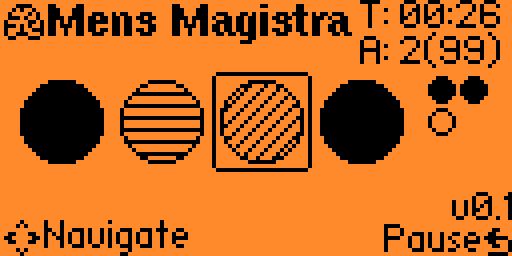

# mitzi-hirn
A simple Flipper Zero combination cracking game.

A one-player logic game where Flipper Zero creates a secret color code with 4 symols of 6 different colors . The user has to guess it in the fewest attempts. She/He receives clues: Black pegs for correct color/position, white pegs for correct color/wrong position.

## Usage
- **Left/Right**: Move Puck-girl through the maze
- **Up/Down**: Restart game (when game over or won)
- **OK**: Send guess for checking (only possible if all four digits have been populate).
- **Long OK**: Give up, i.e. reveal the combination
- **Back Button**: Pauses game or (when held) exits

## More info
The constant `COLOR_REPEAT` controls whether a color can repeat or not.  [default: FALSE]). When guessing, the user has to adjust the color of four 20px diameter circles. Colors are represented by different fill pattern. Empty, non-filled circles are reserved and mean that the user has not chosen a color yet.

After submitting a guess, the colors remain in the current guess area for the next attempt. The "OK" hint only appears when all pegs have colors **and** the guess is different from the previous one.

On the top right we have the heads-up-display (HUD): 
* `T: [MM:SS]` is timer
* `A: [number of attempts](12)`

The game continues until the player either correctly guesses the full sequence, runs out of attempts, or wasted 90 minutes.

## Colors and patterns
We defined:
* Empty `COLOR_NONE`.
* **Red.** Solid black fill
* **Green.** Horizontal lines
* **Blue.** Vertical lines
* **Yellow.** Diagonal lines, pointing NE (/)
* **Purple.** Diagonal lines pointing NW
* **Orange.** Cross-hatch pattern

## Version history
See [changelog.md](changelog.md)

